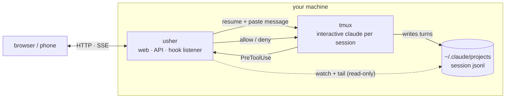

# usher

*Ultra-Simple Harness for Everything Routing.*

Drive multiple Claude Code sessions from any browser — including your phone over
Tailscale.

usher is a web dashboard over the sessions on your machine: list them, send a
message and watch the reply stream in (markdown or raw, for easy copying), and
approve or deny tool-permission prompts — without being at the keyboard.

## What you can do

- Kick off a long refactor or test run and step away — from your phone you can
  watch it stream, send a follow-up or talk through a detail, and approve a
  permission prompt if one comes up.
- Manage sessions across several projects from one dashboard, instead of hunting
  through `claude --resume`.
- Route work from one main chat instead of switching tabs — quick slash commands
  by default, or plain language ("run the tests in the auth session and tell me
  what fails") once you enable the optional LLM agent ([Main chat](#main-chat)).

## Quickstart

Needs Go 1.25+, `tmux` (usher runs each session's claude inside it), and a
`claude` CLI you've already signed in to.

```
make build            # → ./usher
./usher setup         # register the permission hook with Claude Code (once; --remove to undo)
./usher set-password  # optional for local use; recommended before exposing it
./usher serve         # serve on http://127.0.0.1:7777
```

To reach usher from another device, see [Remote access](#remote-access).

## Why usher

- **A thin wrapper, not another agent.** usher drives the official Claude Code
  as-is — no reimplemented agent loop, no thicker framework. The harness does the
  real work; usher adds a GUI, remote access, and session management on top.
- **The same capability from any device.** A thin client over that harness:
  list, resume, send, approve a permission, or start a new session — identical in
  a phone browser and on the desktop, where it installs as a PWA and behaves like
  a native app. (The official GUI doesn't run on Linux; usher works anywhere
  there's a browser — Linux and phones included.)
- **Local-first, your own tunnel.** Sessions, transcripts, and Claude processes
  never leave your machine. No account, cloud, or relay: you reach usher from
  elsewhere by putting it behind [Tailscale](https://tailscale.com/) or a
  [Cloudflare Tunnel](https://developers.cloudflare.com/cloudflare-one/connections/connect-networks/).
- **Tiny and auditable.** A single static Go binary, almost entirely the
  standard library (just `fsnotify` and `golang.org/x/crypto`), with a plain-JS
  frontend — no npm, no build step, no framework.

## Remote access

usher has no relay or cloud component. To use it from another device, run a
tunnel on the same machine and point it at usher's loopback port — usher stays on
`127.0.0.1:7777` and the tunnel reaches it locally.
[Tailscale](https://tailscale.com/) and
[Cloudflare Tunnel](https://developers.cloudflare.com/cloudflare-one/connections/connect-networks/)
both work. Set a usher password too: with a tunnel fronting loopback, usher's
bind gate doesn't trip, so nothing else forces one.

Step-by-step for both tunnels, plus the auth internals and threat model, is in
**[docs/remote-access.md](docs/remote-access.md)**.

## Configuration

`usher serve` has flags for the projects/data dirs, the tmux socket and
live-session cap, the permission mode, and the main-chat backend; run
`usher serve --help` for the full list. The most common:

| Flag | Default | Purpose |
|---|---|---|
| `--addr` | `127.0.0.1:7777` | Listen address. Non-loopback requires a password. |
| `--data-dir` | `$XDG_DATA_HOME/usher` | usher's state (auth, hook socket, chat history). |
| `--permission-mode` | `default` | Passed to claude. `default` uses the hook UI; `bypassPermissions` skips prompting. |
| `--tmux-socket` | `usher` | tmux server socket holding usher's claude windows (`tmux -L <name>`). |
| `--max-live-sessions` | `8` | Cap on live claude processes; least-recently-used are evicted and re-spawned on the next send. |
| `--agent-mode` | `rule` | Main-chat backend: `rule` or `llm` (see below). |

## Main chat

The **main chat** link opens a conversation with usher's routing agent. The
default **rule agent** is a few slash commands:

```
/list                          list sessions (shows auto-approve / archived flags)
/send <prefix> <text>          send to the matching session (by id prefix or title)
/ask <prefix> <text>           send and wait for the session's reply
/read <prefix> [n]             show the last n turns of a session (default 20)
/new <cwd> <text>              start a new session in <cwd> with an initial message
/pending                       list pending permission requests
/approve | /deny <id>          resolve a pending request
/archive | /unarchive <prefix> hide / restore a session
/auto-approve <prefix> on|off  toggle auto-approving the session's prompts
```

The optional **LLM agent** (`--agent-mode llm`) takes natural language instead.
It speaks the OpenAI Chat Completions format, so any OpenAI-compatible backend
works (OpenAI, Anthropic's OAI-compatible endpoint, Ollama, DeepSeek, Groq, …):

```
./usher serve --agent-mode llm \
  --llm-base-url https://api.openai.com/v1 \
  --llm-model gpt-4o-mini \
  --llm-api-key-env OPENAI_API_KEY
```

For a keyless local backend point `--llm-base-url` at it (e.g. Ollama's
`http://localhost:11434/v1`) and pass `--llm-api-key-env ""`. The agent can read
transcripts, send, create sessions, and resolve permissions, and tracks which
session you're working with so you can keep talking as if there's just one.

## How it works



- **Discovery** is read-only: usher watches `~/.claude/projects/` and lists every
  session — including ones you started in your terminal or IDE. It never takes
  ownership.
- **Sending** drives a real interactive `claude` per session, each in its own
  window of a dedicated tmux server: usher resumes the session, pastes your
  message, and tails the jsonl to stream the turn. (Interactive claude runs under
  your Claude subscription, unlike headless `claude -p`.)
- **Permissions** flow through a `PreToolUse` hook that `usher setup` installs
  once (`--remove` to undo). A usher-managed session's tool request reaches usher
  over a local Unix socket and blocks until you decide in the UI; if usher isn't
  running, your sessions fall back to Claude's own prompt.

### Attaching to a session

Each session's claude runs in a tmux window, so you can watch or take over one:

```
tmux -L usher attach -t usher        # -L = socket (--tmux-socket); -t usher = the session usher creates
```

Windows are named by session id (`Ctrl-b w` switches, `Ctrl-b d` detaches). Good
for watching live output or answering a native prompt usher doesn't cover — but
your keystrokes can collide with usher's mid-turn injection, so tread lightly.
Closing a window is harmless; usher re-spawns from jsonl on the next send.

## Roadmap

- **Terminal view** — stream a session's live tmux pane (xterm.js) for full
  output and every Claude Code feature, not just send + approve.
- **Richer main chat** — manage sessions and reach it from IM apps (Telegram,
  Slack); still early today.
- **File viewing** — open images, HTML, and markdown a session produced.
- *Exploring:* scheduled (cron) jobs; other harnesses like Codex.

