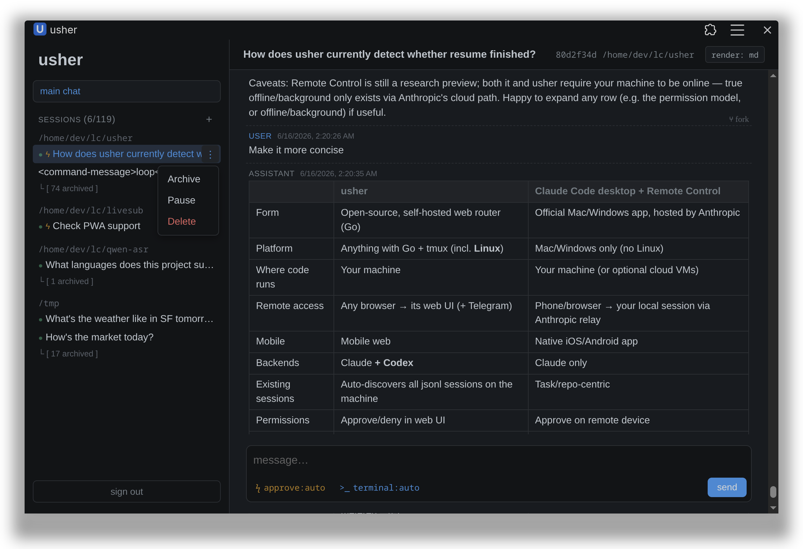
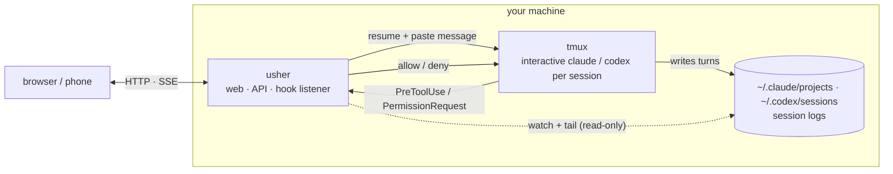

# usher

*Ultra-Simple Harness for Everything Routing.*

Drive multiple Claude Code and Codex sessions from any browser — including your
phone over Tailscale.

<p align="center">
  
</p>

usher is a web dashboard over the sessions on your machine: list them, send a
message and watch the reply stream in (markdown or raw, for easy copying), and
approve or deny tool-permission prompts — without being at the keyboard.

## What you can do

- Kick off a long refactor or test run and step away — from your phone, watch it
  stream, send a follow-up, and approve a permission prompt if one comes up.
- Manage sessions across several projects — and both CLIs, Claude Code and
  Codex, side by side — from one dashboard, instead of hunting through
  `claude --resume` or `codex resume`.
- Route work from one main chat instead of switching tabs — quick slash commands
  by default, or plain language ("run the tests in the auth session and tell me
  what fails") once you enable the optional LLM agent ([Main chat](#main-chat)).

## Install

Needs `tmux` ≥ 2.6 and at least one of the `claude` or `codex` CLIs you've
already signed in to. On Windows, run usher inside
[WSL](https://learn.microsoft.com/en-us/windows/wsl/install).

### One-line install (recommended)

```
curl -fsSL https://raw.githubusercontent.com/nexustar/usher/main/install.sh | bash
```

Installs the binary, registers permission hooks, and starts a user-level
service (launchd / systemd). No `sudo` required.

### Build from source

```
go install github.com/nexustar/usher/cmd/usher@latest
usher setup         # register permission hooks (once; --remove to undo)
usher serve         # http://127.0.0.1:7777
```

To run as a service, see the example files in
[`docs/`](docs/) ([macOS plist](docs/io.github.nexustar.usher.plist),
[Linux systemd](docs/usher.service)).

To reach usher from another device, see [Remote access](#remote-access).

## Why usher

- **A thin wrapper over the native claude/codex CLIs.** usher drives the official
  Claude Code and Codex CLIs exactly as they ship — not another agent or a layer
  on top, no reimplemented agent loop. The CLIs do the work; usher adds a GUI,
  remote access, and session management over both.
- **The same actions from any device.** List, resume, send, approve a permission,
  start a session — identical on phone and desktop, where it installs as a PWA.
  (The official GUI skips Linux; usher runs anywhere there's a browser.)
- **Local-first, your own tunnel.** Sessions, transcripts, and CLI processes never
  leave your machine. No account, cloud, or relay — reach it from elsewhere via
  [Tailscale](https://tailscale.com/) or a
  [Cloudflare Tunnel](https://developers.cloudflare.com/cloudflare-one/connections/connect-networks/).
- **Tiny and auditable.** A single static Go binary, almost all standard library
  (just `fsnotify` and `golang.org/x/crypto`), with a plain-JS frontend — no npm,
  no build step, no framework.

## Remote access

usher has no relay or cloud component. To use it from another device, run a
tunnel on the same machine and point it at usher's loopback port — usher stays on
`127.0.0.1:7777` and the tunnel reaches it locally.
[Tailscale](https://tailscale.com/) and
[Cloudflare Tunnel](https://developers.cloudflare.com/cloudflare-one/connections/connect-networks/)
both work. Set a usher password too: with a tunnel fronting loopback, usher's
bind gate doesn't trip, so nothing else forces one.

Step-by-step for both tunnels, plus the auth internals and threat model, is in
**[docs/remote-access.md](docs/remote-access.md)**.

## Configuration

`usher serve --help` lists every flag. Each backend turns on only if its session
dir exists, so usher runs with either CLI or both (it needs at least one). The
most common:

| Flag | Default | Purpose |
|---|---|---|
| `--addr` | `127.0.0.1:7777` | Listen address. Non-loopback requires a password. |
| `--data-dir` | `$XDG_DATA_HOME/usher` | usher's state (auth, hook socket, chat history). |
| `--projects-dir` | `~/.claude/projects` | Claude Code session dir; enables the Claude backend when present. |
| `--codex-sessions-dir` | `~/.codex/sessions` | Codex session dir; enables the Codex backend when present. |
| `--permission-mode` | `default` | Claude only. `default` uses the hook UI; `bypassPermissions` skips prompting. |
| `--tmux-socket` | `usher` | Prefix for usher's tmux sockets: Claude on `<name>-claude`, Codex on `<name>-codex`. |
| `--max-live-sessions` | `8` | Cap on live CLI processes; least-recently-used are evicted and re-spawned on the next send. |
| `--agent-mode` | `rule` | Main-chat agent: `rule` or `llm` (see below). |

## Main chat

The **main chat** link opens a conversation with usher's routing agent.
Sending never blocks the chat: a routed message returns immediately, and when
the target session finishes its turn the reply is posted back into the chat
verbatim — whether that takes seconds or hours. The default **rule agent** is
a few slash commands:

```
/list                          list sessions (shows auto-approve / archived flags)
/send <prefix> <text>          send to the matching session (by id prefix or title)
/ask <prefix> <text>           send and wait inline for the session's reply
/read <prefix> [n]             show the last n turns of a session (default 20)
/new <cwd> <text>              start a new session in <cwd> with an initial message
/pending                       list pending permission requests
/approve | /deny <id>          resolve a pending request
/archive | /unarchive <prefix> hide / restore a session
/auto-approve <prefix> on|off  toggle auto-approving the session's prompts
```

The optional **LLM agent** (`--agent-mode llm`) takes natural language instead.
It speaks the OpenAI Chat Completions format, so any OpenAI-compatible backend
works (OpenAI, Anthropic's OAI-compatible endpoint, Ollama, DeepSeek, Groq, …):

```
./usher serve --agent-mode llm \
  --llm-base-url https://api.openai.com/v1 \
  --llm-model gpt-4o-mini \
  --llm-api-key-env OPENAI_API_KEY
```

For a keyless local backend point `--llm-base-url` at it (e.g. Ollama's
`http://localhost:11434/v1`) and pass `--llm-api-key-env ""`. The agent can read
transcripts, send, create sessions, and resolve permissions, and tracks which
session you're working with so you can keep talking as if there's just one.

## How it works



- **Discovery** is read-only: usher watches `~/.claude/projects/` and
  `~/.codex/sessions/`, listing every session — including ones you started in a
  terminal or IDE — tagged with the CLI that produced it. It never takes ownership.
- **Sending** drives a real interactive `claude` or `codex` per session, each in
  its own tmux window (the two CLIs on separate sockets): usher resumes it, pastes
  your message, and tails the session log to stream the turn — running under your
  own subscription, unlike headless `claude -p`. New sessions route by the model
  you pick: `claude-*` → Claude Code, `gpt-*` → Codex.
- **Permissions** flow through Claude's `PreToolUse` and Codex's
  `PermissionRequest` hooks that `usher setup` installs for the CLIs present
  (`--remove` to undo). A tool request reaches usher over a local Unix socket and
  blocks until you decide in the UI; if usher isn't running, sessions fall back to
  the CLI's own prompt.

### Attaching to a session

Each session's CLI runs in a tmux window, so you can watch or take over one:

```
tmux -L usher-claude attach          # Claude on usher-claude, Codex on usher-codex (the --tmux-socket prefix)
```

Windows are named by session id
(`Ctrl-b w` switches, `Ctrl-b d` detaches). Useful for watching live output or
answering a native prompt usher doesn't cover — but your keystrokes can collide
with usher's mid-turn injection, so tread lightly. Closing a window is harmless;
usher re-spawns on the next send.

## Roadmap

- **Terminal view** — stream a session's live tmux pane (xterm.js) for full
  output and every Claude Code feature, not just send + approve.
- **Richer main chat** — manage sessions and reach it from IM apps (Telegram,
  Slack); still early today.
- **File viewing** — open images, HTML, and markdown a session produced.
- *Exploring:* scheduled (cron) jobs.

## Non-goals

- **A generic multi-harness platform.** usher wraps exactly two CLIs — Claude
  Code and Codex — each integrated deliberately (discovery, hooks, fork, model
  routing). It is not a plugin host for arbitrary CLIs, and there's no plan for a
  third.
- **Owning your sessions.** Discovery stays read-only and observational; usher
  drives the official CLIs rather than replacing them with its own agent loop.

